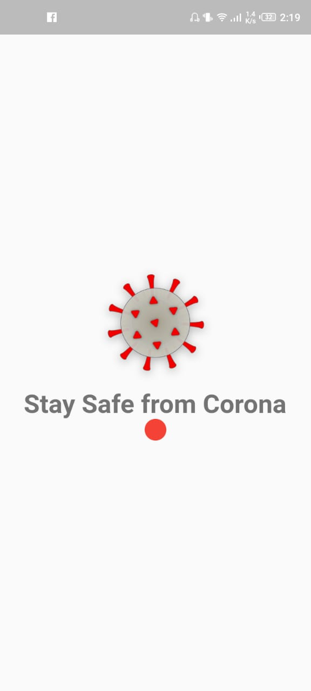
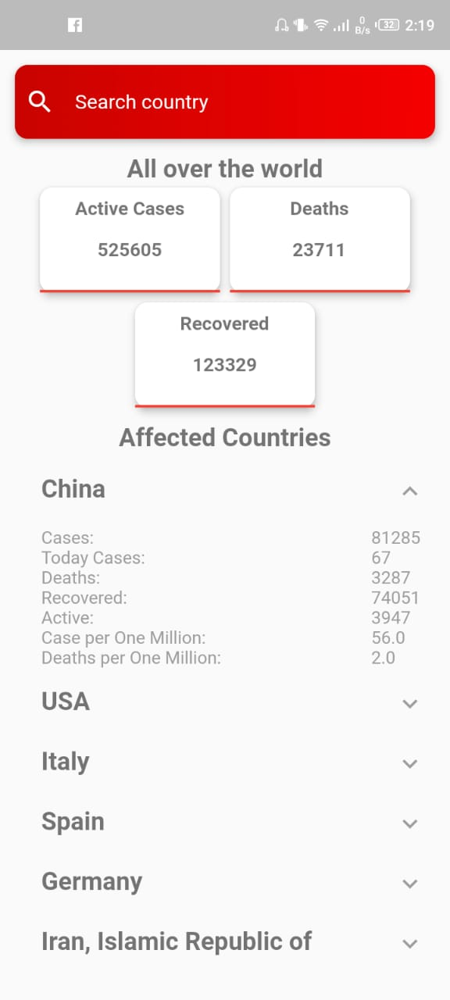

# Stay Safe from Corona-virus

A simple mobile app that provides you with important information related to coronavirus around you. Options Select Location manually or Allow the extension to get your location Get Important statistics regarding corona near the selected location on timely basis Set the update time to either 1 minute, minutes, 10 minutes, 1 hour, 3 hour, 6 hours or daily. 

# Sample screen

# Note 
You are free to copy, reuse, update and learn from the code of this mobile app. This app is built for public service and also to spread awareness regarding Covid-19 Coronavirus.

# Chrome Extension Link
https://github.com/osamaishtiaq/Stay-safe-from-coronavirus
